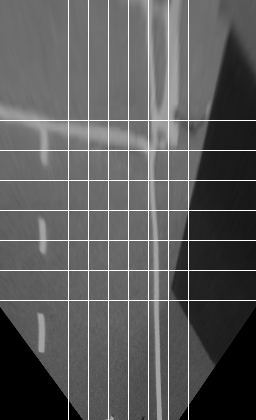

# Automodel-CIC-IPN
Welcome to the CIC's AutoModel Car gitHub. This repository contents the code for the next modules:

- Image processing and camera adjustment (C++ and Python).
- Lane follower (C++ and Pyhton).
- Intersection detector (C++ and Pyhton).
- Obstacke detection (C++ and Pyhton).
- Joystick (C++).

The ROS distro used is Indigo along with Ubuntu 14.10 LTS. All the C++ and Pyhton Modules are included in different ROS packages. The launch files are also included.

**IMPORTANT: Before starting, make sure you have ROS and all it's deppendencies properly installed on your PC! Otherwise, visit the [ROS Tutorials](http://wiki.ros.org/ROS/Tutorials/InstallingandConfiguringROSEnvironment).**

## Cloning the repository
In order to start working with the code, first clone the repository by typing:

> git clone https://github.com/Conilo/automodelcar-cic-ipn.git

## Build the code:
Then, it's necesarry to compile the code (also after modifiying any file or node source). To do so, type:

> bash compile.bash

To compile the code in "release mode" add the `-s` flag:

> bash compile.bash -s

## Run the code
The cic package contains different launch files in order to execute specific tasks. The next subsections explain all the launch files intended functions.

### Camera adjustment

To run the camera adjustment launch, type:

> roslaunch cic camera_adjustment.launch

A debug window will be displayed with a chessboard layout (see figure 1). To adjust the camera, you will need a printed chesboard pattern of 35x35 [cm]. Lay down the printed pattern in front of the camera and modify the parameters in the launch in order to match the chessboard pattern with the one displayed. Those parameters are:

- Pixel to cm ratio in the X-axis.
- Pixel to cm ratio in the Y-axis.
- Scaling factor for the X-axis.
- Scaling factor for the Y-axis.
- Four points to wrap the image in birdview.

Figure 1: Chessboard pattern displayed on camera adjustmen mode.

### Autonomous mode
TODO

## Contact:
If you need more info about the code, please contact:

* Project Coordinator:
Erik Zamora Gómez (e-mail: ezamora1981@gmail.com).

* Project Manager: 
Cesar Gerardo Bravo Conejo  (e-mail: conilo@gmail.com).

Student assistants:
- Brenda Camacho Garcia (e-mail: brendacg616@gmail.com).
- Esteban Iván Rojas Hernández (e-mail: rojasesteban23@gmail.com).
